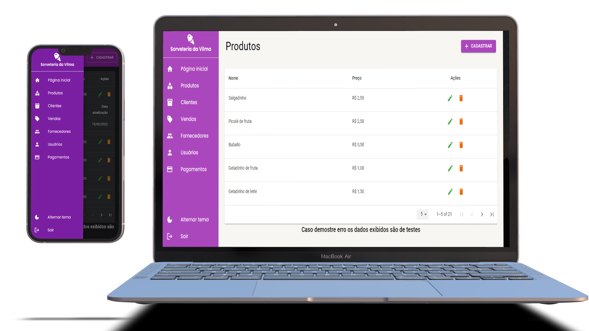

<h4 align="center">
    :computer: App Verzel - Aplicação para gerenciamento do fluxo de caixa de uma sorveteria
</h4>

    <a href="#-projeto">Projeto</a>&nbsp;&nbsp;&nbsp;|&nbsp;&nbsp;&nbsp;
    <a href="#rocket-tecnologias">Tecnologias</a>&nbsp;&nbsp;&nbsp;|&nbsp;&nbsp;&nbsp;
    <a href="#user-content-clipboard-instruções">Instruções</a>&nbsp;&nbsp;&nbsp;|&nbsp;&nbsp;&nbsp;
    <a href="#-ajustes-e-melhorias">Melhorias</a>

 

## 💻 Projeto

Frontend App em ReactJS. Plataforma web responsiva para gerenciamento de caixa de uma sorveteria. Com as funcionalidades de crud e relacionamentos para produtos, clientes, vendas, fornecedores, usuários e pagamentos, tela de dashboard sobre vendas por períodos, e tela de login com autenticação.

Repositório Api vinculada: https://github.com/ygor-salles/ice-cream-api 

 

## :rocket: Tecnologias

- [Typescript](https://www.typescriptlang.org/)
- [ReactJS](https://pt-br.reactjs.org/)
- [styled-components](https://styled-components.com/)
- [material-ui](https://mui.com/pt/)
- [react-hook-form](https://react-hook-form.com/)
- [yup](https://www.npmjs.com/package/yup)
- [axios](https://axios-http.com/)

---

## :clipboard: Instruções

### INTERFACE - FRONTEND

- Execute `$ yarn` para instalar todas as dependencias.
- Crie um arquivo `.env` e preencha as informações de cada variável de ambiente, as variáveis para serem preenchidas se encontram no arquivo `env.example`.
- Após todas as dependencias serem instaladas e as variáveis serem preenchidas, basta executar `yarn start` para iniciar a interface frontend.

---

## 📌 Ajustes e melhorias

O projeto ainda está em desenvolvimento e as próximas atualizações serão voltadas nas seguintes tarefas:

- [ ] Tela pagina inicial (Dashboard)
- [ ] Integração produtos (Editar, Deletar)
- [ ] Tela Clientes
- [ ] Tela Vendas (Exibir, Editar, Deletar) e Integração
- [ ] Tela Fornecedores
- [ ] Tela Usuários
- [ ] Tela Pagamentos
- [ ] Login (Ao digitar login e senha incorreto não está exibindo mensagem de erro e "sumindo" a tela)
